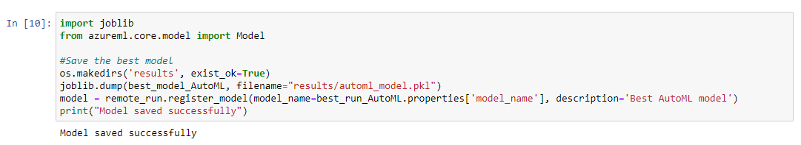

# Machine-Learning-with-the-Titanic-dataset-on-Azure
## Overview
This project is done as a part of Udacity's 'Machine Learning Engineer with Microsoft Azure' nanodegree course. We have to train, deploy and consume the model endpoint. I have used Azure Machine Learning SDK for Python to build and run machine learning workflows. Training the dataset is done using 2 methods: 
- Optimize the hyperparameters of a standard Scikit-learn Logistic Regression using HyperDrive. 
- AutoML run. 

## Architecture diagram

## Dataset
The project uses [Kaggle's titanic dataset](https://www.kaggle.com/c/titanic/data). 
Since Kaggle doesn’t provide us with the predictions of test dataset, I have only train.csv in this project. Dataset contains details of 891 unique passengers. The classification goal is to predict the survival of a passenger (0-No, 1-Yes) given their individual PassengerId, Name, Sex, Age, Pclass (Ticket class: 1-1st, 2–2nd, 3–3rd), SibSp(Number of siblings / spouses on the ship), Parch(Number of parents / children on the ship), Ticket(Ticket number), Fare(Passenger fare), Cabin(Cabin number), Embarked(Port of embarkation: C-Cherbourg, Q-Queenstown, S-Southampton).

## Project description
### Data analysis and pre-processing:
Exploratory Data Analysis (EDA) is one of the crucial step in data science that allows us to achieve certain insights and statistical measures that are essential for prediction. Execute [EDA.ipynb](Files/EDA.ipynb) to perform this. 
- 687 cabin entries are missing, first remove the ‘Cabin’ column. After which, impute the missing values of columns- Age and Embarked.
- Perform univariate, bivariate and multivariate analysis of the data.
- Drop some columns and perform one-hot encoding on the rest. 
- Split the dataset into train and test sets (80:20)

We can make some improvements here i.e., instead of dropping the column ‘Name’ , sort it based on the surnames. Boxplot says that there are some outliers in our data. Thus, to improve the model performance, remove them. Though Kaggle submission doesn’t allow outlier removal, for personal uses consider removing them. 

After the whole process, dataset can be visualized as:

###  Model training:
I have used Azure ML SDK to programmatically control the pipeline with Python. This can be done using:

**1.  Train the model on Logistic regression algorithm and optimize the hyperparameters using HyperDrive:** Logistic Regression is a supervised classification algorithm that is used to predict the probability of a categorical dependent variable (i.e., Survived). I have used scikit-learn‘s Logistic Regression module to train the model. Hyperparameters are adjustable parameters choosed for model training that guide the training process. HyperDrive package(HyperDriveConfig) helps us to choose the parameters automatically. 

- **Parameter sampler:** The parameter sampling method chosen for this experimnent is Bayesian sampling. Bayesian parameter sampler intelligently picks the next sample of hyperparameters based on the previous samples. The new sample improves the reported primary metric, i.e. Accuracy in our case. Here, the defined spaces are, -C (inversion of regularization strength): uniform (0.01, 1), ie, It returns values uniformly distributed between 0.01 and 1.00. -max-iter (maximum number of iterations): choice (100, 150, 200, 250, 300), ie, It returns a value chosen among given discrete values 100, 150, 200, 250, 300.

- **Primary metric:** The primary metric refers to the output of the process under consideration. The state of the output needs to be consistently measured, errors must be spotted and correction must be immediately made. It is therefore of vital importance to identify the correct primary metrics. Though we have explicitely specified 'accuracy' as primary metric, by default 'accuracy' itself is used for classification tasks.

Execute [Hyperparameter_Tuning.ipynb](Files/Hyperparameter_Tuning.ipynb) to perform this. HyperDrive run will begin as soon as we specify the parameters and submit the run.

#### Analysis:
The results obtained after run are as follows:

#### Retrieve and save the best model:
Use 'joblib.dump()' to save the model file. Whenwe have to deploy the same model, we have to register the same saved model first and then deploy it to receive an endpoint using .register_model().

**2. AutoML:** Automated machine learning (or) AutoML is the process of automating the machine learning problems in real-world . During training, AML creates a number of pipelines in parallel that try different algorithms and parameters for you. The service iterates through ML algorithms paired with feature selections, where each iteration produces a model with a training score. Since AutoML only accepts AML TabularDatasets when working on a remote compute, convert pandas dataframe to TabularDataset and then fill in all the parameters of AutoMLConfig(). AutoML configuration object contains and persists the parameters for configuring the experiment run, as well as the training data to be used at run time. experiment_timeout_mins (30) , task (classification), Primary metric (accuracy), n_cross_validations (5), compute_target, training_data, label_column_name (Survived) are the parameters specified. Execute [AutoML.ipynb](Files/AutoML.ipynb) to perform this.

#### Analysis:
The results obtained after run are as follows:

#### Retrieve and save the best model:
Use 'joblib.dump()' to save the model file. Whenwe have to deploy the same model, we have to register the same saved model first and then deploy it to receive an endpoint using .register_model().

The best algorithms chosen by the run are MaxAbsScalar and LightBGM. They gave an accuracy of 81.1%

Finally, save the model for future use. 

### Model deployment:
Deployment is about delivering a trained model into production so that it can be consumed by others. In Azure, deploying the best model will allow it to interact with the HTTP API service and interact with the model by sending data over POST requests. In this project, I have deployed the model into a production environment using Azure Container Instance (ACI). ACI offers the fastest and simplest way to run a container without having to manage any virtual machines and without having to adopt a higher-level service. Also, authentication is enabled to prevent unauthorized access.

I have deployed the saved AutoML python model and for that first we have to create a container instance and set the number of cpu_cores and memory_gb based on our requirements. We should then create an InferenceConfig instance to link our environment and entry script. Entry script [score.py]() is directly taken from Azure ML studio after saving the model. Once they are specified, deploy the model. 

In AML, we can also consume a deployed service via an HTTP API. An HTTP API is a URL that is exposed over the network so that interaction with a trained model can happen via HTTP requests. For this, first we will first give 2 sets of data to score (Either give the data by yourself or use Swagger documentations to get the format). The APIs exposed by Azure ML will use JSON to accept data and submit responses and serve as a bridge language among different environments. Execute [endpoint.py](Files/endpoint.py) to perform this.

## Standout suggestions: 
**1. Convert the python model to ONNX format:** The Open Neural Network exchange (ONNX) is an open source portability platform that allows us to easily convert models from one framework to other, or even deploy the models to Android / iOS devices.

To test if the model is successfully converted, I had sent the test dataset to the model for it to predict:

**2. Enable logging in the deployed web app:** Application Insights is a very useful tool to detect anomalies and visualize performance. I have specified enable_app_insights=True in the container instance. 

## Future improvements
- As mentioned, the titanic dataset can be cleaned and transformed in a better way.
- I’ve not much experimented with the parameters I chose. Try to vary them and improve the model accuracy before deploying.
- Deploy the ONNX model instead of the regular python model.
- Explore more on Azure IoT edge and deploy your model to the edge.

## Screencast
- Access the detailed recording [here](https://drive.google.com/file/d/1Rk0RDdDzcnGk56rUKuPeuEfNJ_WDdY2t/view?usp=sharing)
- Access the required recording [here](https://drive.google.com/file/d/1asPRldycOlrf0gxkn9XCQtpduxic1ps5/view?usp=sharing)

## Blog
- Access the blog post [here](https://parvatijay2901.medium.com/machine-learning-with-titanic-dataset-on-azure-117dc9073976)

## References
- [Microsoft Documentations](https://docs.microsoft.com/en-us/documentation/)
- [Udacity course contents- Machine learning engineer for Microsoft Azure](https://www.udacity.com/course/machine-learning-engineer-for-microsoft-azure-nanodegree--nd00333)
